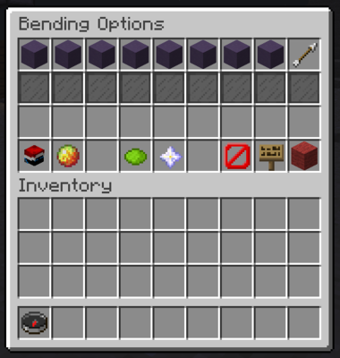
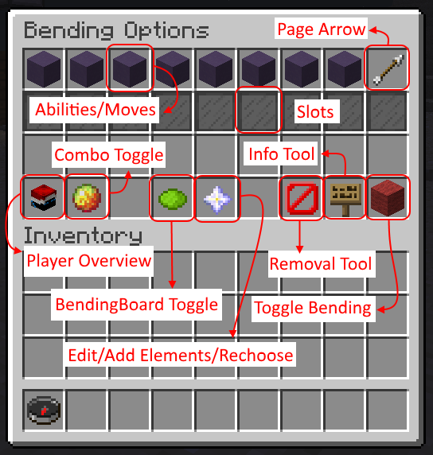

# BendingGUI

BendingGUI is side-plugin for ProjectKorra that adds a custom interface for players to use with bending.

### Feature List:

- Easy, well organised design.
- Browse through the list of moves with the arrows along the top.
- All moves have different icons depending on their base element. E.g. Water moves are blue stained clay, earth moves are grass, etc
- You can easily see what moves you have bound to what slot (even color coordinated).
- Remove bound moves with the removal tool
- Get help with moves with the help tool
- Toggle your bending off and on with the toggle tool
- Combos can be shown with the combo toggle
- BendingBoard can be toggled (if it's installed on the server).
- Admins or OPs can edit everyone's bending without leaving the GUI

### Commands:

- */gui* - Gives the user the compass to access the gui or just opens the gui (configurable in the configuration file)
- */gui choose* - Opens a gui allowing the user to choose an element. This will happen if the user tries to open the interface without any elements anyway.
- */gui version* - Shows the version of BendingGUI and notifies the user if there may be incompatibilities. Default is op only.
- */gui reload* - Reloads the config for BendingGUI. Default is op only.
- */gui <player>* - Allows the user to view another players bending through the gui. By default, this is op only.

There is also a */bending gui* command if you like things nice and tidy!

### Permissions:

- *bendinggui.command* - Gives access to the /gui command.
- *bendinggui.view* - Allows the user to see what elements everyone else can bend.
- *bendinggui.version* - Allows the user to use /gui version
- *bendinggui.reload* - Allows the user to use /gui reload
- *bendinggui.admin* - Allows the user to view/edit/choose another player's bending. This defaults to op only.

### How to use:

Moves/Abilities are displayed along the top of the interface, with arrows to go to the next page, etc. To bind a move, you simply click the move you want to bind and then click the slot you want to bind it to (the stained glass). Slots with moves will be colored and will display what move they are, and can also be removed with the removal tool (the barrier icon).

If you want to know more information on a move OR how to use it, click the info tool (sign/map) then click the move you want help with.

Your bending can also be toggled with the stained clay/wool so your bending doesn't get in the way of small tasks. :)

TL;DR: Just click and click. It's simple enough. ;)

### Configuration:
The main configuration file is found at _/plugins/BendingGUI/config.yml_. In there, you can configure what the element and subelement icons are for the moves. You can also configure what item opens the GUI or if an item is required at all. Setting Gui.UserIcon.EnableSubElements to true will also mean that all player icons will show what sub-elements a user can bend. Disabled by default because it takes up a lot of room.

lang.yml also contains all the short descriptions for all the moves. I've tried to include all moves from JedCore as well as PK, but if you find a move saying "***Description coming soon!***", just add it to the lang.yml

### Requirements:

- Spigot 1.12 
- ProjectKorra 1.8.7
